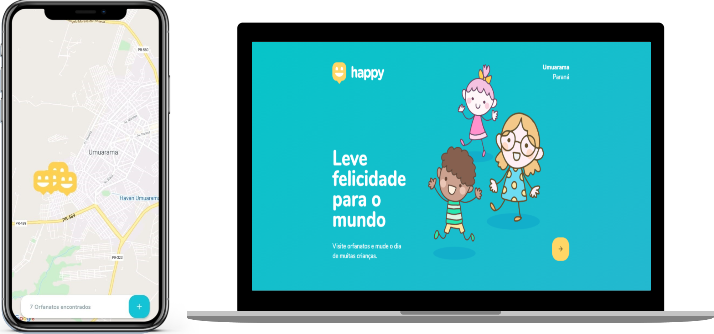

<h1 align="center">
    
</h1>

<p align="center">
  <a href="#-tecnologias">Tecnologias</a>&nbsp;&nbsp;&nbsp;|&nbsp;&nbsp;&nbsp;
  <a href="#-iniciando-o-projeto">Projeto</a>&nbsp;&nbsp;&nbsp;|&nbsp;&nbsp;&nbsp;
  <a href="#-layout">Layout</a>&nbsp;&nbsp;&nbsp;|&nbsp;&nbsp;&nbsp;
  <a href="#-licença">Licença</a>
</p>
<br>

<p align="center">
  
</p>

## 🚀 Tecnologias

Este projeto foi desenvolvido utilizando as seguintes tecnologias:

- [Node.js](https://nodejs.org/en/)
- [ReactJS](https://reactjs.org/)
- [React Native](https://reactnative.dev/)
- [TypeScript](https://www.typescriptlang.org/)

## 🤹‍ Sobre o Happy

O Happy é um projeto que visa facilitar visitas aos orfanatos próximos a você 💜 

Este projeto foi desenvolvido durante a **[Next Level Week](https://nextlevelweek.com/)**, realizada pela **[@Rocketseat](https://github.com/Rocketseat)** com o instrutor **[@diego3g](https://github.com/diego3g)** 

## 🎨 Layout

Você pode visualizar o layout do projeto através dos links abaixo:

- [Layout Web](https://www.figma.com/file/mDEbnoojksG4w8sOxmudh3/Happy-Web?node-id=0%3A1) 
- [Layout Mobile](https://www.figma.com/file/X27FfVxAgy9f5IFa7ONlph/Happy-Mobile?node-id=0%3A1) 

Lembrando que você precisa ter uma conta no [Figma](http://figma.com/) para acessá-lo.

## 💻 Iniciando o Projeto

### Requisitos

- [Node.js](https://nodejs.org/en/)
- [Yarn](https://classic.yarnpkg.com/)
- [Expo](https://expo.io/)

```bash
$ git clone https://github.com/vinive/nlw3-happy.git
```

**Siga os passos abaixo: **

### 🔧 Backend

```bash
# Acesse a pasta backend
$ cd backend

# Instale as dependências
$ yarn

# Rode as migrations
$ yarn typeorm migration:run

# Inicie a API
$ yarn dev

# Pronto, projeto iniciado!
```

### 🌐 Web

Obs.: Antes de continuar, certifique-se que a API esteja rodando.

```bash
# Acesse a pasta web
$ cd web

# Instale as dependências
$ yarn

# Certifique-se de que o arquivo 'src/services/api.ts' tenha o IP para sua API

# Inicie o cliente
$ yarn start
```

### 📱 Mobile

Obs.: Antes de continuar, certifique-se que a API esteja rodando.

```bash
# Acesse a pasta mobile
$ cd mobile

# Certifique-se de que o arquivo 'src/services/api.ts' tenha o IP para sua API

# Inicie o serviço e escaneie o código QR com o Cliente Expo
$ yarn start
```

## 📝 Licença

Esse projeto está sob a licença MIT. Veja o arquivo [LICENSE](LICENSE.md) para mais detalhes.

---

<p align="center">Desenvolvido com 💜 por ViniciusVE</p>
